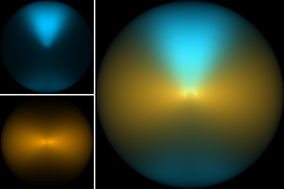

# HYPERCAT

Hypercubes of (clumpy) AGN tori



*Hypercat images at 2.2 (blue) and 30 micron (gold), and their composite.*

## Synopsis

Handle a hypercube of CLUMPY brightness maps and 2D projected dust
maps. Easy-to-use classes and functions are provided to interpolate
images in many dimensions (spanned by the model parameters), extract
monochromatic or multi-wavelength images, as well as rotate images,
zoom in and out, apply PSFs, extract interferometric signals, quantify
morphologies, etc.

## Authors

Robert Nikutta [\<robert.nikutta@gmail.com\>](mailto:robert.nikutta@gmail.com), Enrique Lopez-Rodriguez, Kohei Ichikawa

## Version

Version of this document: 2022-09-24

Current version of the HYPERCAT package: 

## License and Attribution

HYPERCAT is open-source software and freely available at
https://github.com/rnikutta/hypercat/ and
https://pypi.org/project/hypercat/ under a permissive [BSD 3-clause
license](./LICENSE) .

In short, if you are using in your research any of the HYPERCAT
software or its components, and/or the HYPERCAT model data hypercubes,
and/or telescope pupil images, please cite these two papers:

- *Nikutta, Lopez-Rodriguez, Ichikawa, Levenson, Packham, Hönig,
  Alonso-Herrero, "Hypercubes of AGN Tori (Hypercat) -- I. Models and
  Image Morphology", ApJ (2021, accepted)*

- *Nikutta, Lopez-Rodriguez, Ichikawa, Levenson, Packham, Hönig,
  Alonso-Herrero, "Hypercubes of AGN Tori (Hypercat) -- II. Resolving
  the torus with Extremely Large Telescopes", ApJ (2021, accepted)*


## Minimal install instructions

If you don't mind installing HYPERCAT and its dependencies into your
current environment (real or virtual), simply run:

```
pip install hypercat
```

or, if you are installing over an older version:

```
pip install hypercat --upgrade
```

If you prefer to install HYPERCAT into a fresh new environment without affecting your existing Python installation, you can create a new environment in various ways.

**If you are a user of conda / anaconda / miniconda / astroconda:**

We recommend to update the conda-installled packages first (but you also first try to install HYPERCAT without updating):

```
conda update --all
```

After that:

```
conda create -n hypercat-env python=3.7.2
conda activate hypercat-env

pip install hypercat --upgrade
```

**If you are a user of pyenv:**

```
pyenv install 3.7.2
. .venv/bin/activate

pip install hypercat --upgrade
```

### Installation trouble-shooting

tbw

## HYPERCAT / CLUMPY model images and 2D dust cloud maps

Hypercat needs to access the hypercubes of Clumpy images and dust
maps. They can be downloaded as hdf5 files from the link given at
https://www.clumpy.org/images/ (which currently is
ftp://ftp.tuc.noirlab.edu/pub/nikutta/hypercat/).

We offer several model files, which only differ in the wavelength range they cover:

|File name                       | Size compressed / raw (GB) | Nwave | Wavelengths (micron) |
|--------------------------------|----------------------------|-------|----------------------|
| `hypercat_20200830_all.hdf5`   | 271 / 913                  | 25    | all of the below     | 
| `hypercat_20200830_nir.hdf5`   |  44 / 146                  |  4    | 1.2, 2.2, 3.5, 4.8   | 
| `hypercat_20200830_mir.hdf5`   | 120 / 402                  | 11    | 8.7, 9.3, 9.8, 10, 10.3, 10.6, 11.3, 11.6, 12, 12.5, 18.5 | 
| `hypercat_20200830_fir.hdf5`   |  65 / 219                  |  6    | 31.5, 37.1, 53, 89, 154, 214 | 
| `hypercat_20200830_submm.hdf5` |  42 / 146                  |  4    | 350, 460, 690, 945   | 


**Download and unpacking**

For example, the `*_all.hdf5.gz` file contains the image hypercube at
all sampled wavelengths. This is the maximally compressed version of
the hdf5 file, which must be uncompressed on the user’s computer
system. To reduce the peak storage required on the target computer,
both steps can be executed in one go (all commands in a single line):

```
lftp -e 'set net:timeout 10; cat /pub/nikutta/hypercat/hypercat_20200830_all.hdf5.gz; bye' ftp.tuc.noirlab.edu | gunzip >
hypercat_20200830_all.hdf5
```

The program `lftp` must be installed on the target system, and 913 GB
of space must be available on it (but only 271 GB of compressed data
will be downloaded).


**File validation**

One should also download the checksums file
`ftp://ftp.tuc.noirlab.edu/pub/nikutta/hypercat/hypercat_20200830.md5`
and verify the hypercube file:

```
# this can take 30 minutes even on a modern computer
md5sum --ignore-missing -c hypercat_20200830.md5
hypercat_20200830_all.hdf5: OK

# or on MacOS and BSD variants
md5 hypercat_20200830_all.hdf5

#... and compare the printed hash with the one in the .md5 file
```

**Pointing HYPERCAT to a model file**

The software, and the example Jupyter notebooks (see below) will need
to be instructed about the location of the model file(s). This is very
easy to do upon loading the model file; the notebooks have several
examples on how to accomplish this, e.g.

```
import hypercat as hc
fname = 'hypercat_20200830_all.hdf5' # use your local location to the HDF5 model file
cube = hc.ModelCube(fname,hypercube='imgdata')  # use 'imgdata' for brightness maps, and 'clddata' for 2D cloud maps
```

## Example Jupyter notebooks

Several Jupyter example notebooks demonstrate some of HYPERCAT's
functionality. The easiest way to obtain them is to clone the HYPERCAT
GitHub repository, and to run the notebooks from there. Cloning the
repository will also download all necessary supplemental files used in
some notebooks such as, e.g., the telescope pupil images and the dust
opacity curve:

```
git clone https://github.com/rnikutta/hypercat.git  # clone the git repository
cd hypercat/examples/  # change to the directory with example notebooks
jupyter-lab ./&  # run the notebooks locally; JupyterLab must be installed
```

- [01-hypercat-basics.ipynb](https://github.com/rnikutta/hypercat/tree/master/examples/01-hypercat-basics.ipynb):
  Loading a model hypercube, generating model images, images at
  multiple wavelengths, images at multiple values of other model
  parameters, accessing cloud maps

- [02-hypercat-astro.ipynb](https://github.com/rnikutta/hypercat/tree/master/examples/02-hypercat-astro.ipynb):
  Adding physical units to images, world coordinate system, field of
  view and pixel scale operations, image rotation / position angle,
  saving to FITS files

- [03-hypercat-singledish.ipynb](https://github.com/rnikutta/hypercat/tree/master/examples/03-hypercat-singledish.ipynb):
  Telescope pupil images (JWST, Keck, GMT, TMT, ELT), simulating
  observations with single-dish telescopes, noisy observations,
  Richardson-Lucy deconvolotuion, detector pixel scale, flux
  preservation, observations at multiple wavelengths

- [04-hypercat-morphology-intro.ipynb](https://github.com/rnikutta/hypercat/tree/master/examples/05-hypercat-morphology-intro.ipynb):
  Introduction to morphological measurements (on 2D Gaussians), image
  centroid, rotation, measuring size of emission features, elongation,
  half-light radius, Gini coefficient

- [05-hypercat-morphology-clumpy.ipynb](https://github.com/rnikutta/hypercat/tree/master/examples/05-hypercat-morphology-clumpy.ipynb):
  Morphology of the HYPERCAT model images; morphological sizes,
  elongation, centroid location; compare morphologies of of emission
  and their underlying dust distributions; from 2D cloud maps to real
  cloud numbers per LOS; photon escape probability along a LOS


## User Manual

WARNING -- the User Manual is still work-in-progress:

For more detailed installation instructions and other usage examples,
please see the HYPERCAT User Manual [User Manual](./docs/manual/) (in
addition to the [example Jupyter notebooks](./examples/) )

## Contributing

Bug fixes and feature contributions to HYPERCAT are welcome. Please
make a pull request against the 'master' branch.
