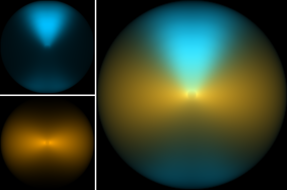

# HYPERCAT — Hypercubes of AGN Tori

[](https://pypi.org/project/hypercat/)
[](https://anaconda.org/conda-forge/hypercat)
[](https://hub.docker.com/r/rnikutta/hypercat)
[](https://hypercat.readthedocs.io/en/latest/)
[](https://github.com/rnikutta/hypercat/actions/workflows/testing-and-coverage.yml)
[](https://github.com/rnikutta/hypercat/actions/workflows/testing-and-coverage.yml)
[](https://lincc-ppt.readthedocs.io/en/latest/)



*Hypercat images at 2.2 μm (blue) and 30 μm (gold), and their false-colour composite.*

## What is Hypercat?

Hypercat is a Python toolkit for working with the **CLUMPY** hypercubes of AGN
torus model images (Nenkova et al. 2008). The CLUMPY models describe infrared
emission from a dusty, clumpy torus surrounding an active galactic nucleus. The
image hypercube spans a seven-dimensional parameter space (inclination, torus
width, radial extent, cloud number, cloud distribution, optical depth,
wavelength) and contains hundreds of thousands of pre-computed images.

Hypercat provides:

- **N-dimensional interpolation** — retrieve a model image at any parameter
  combination via multi-linear or cubic-spline interpolation, with
  memory-mapped HDF5 access (only the needed slab is loaded into RAM)
- **Physical calibration** — attach luminosity, distance, and position angle to
  obtain images in physical brightness units (Jy/arcsec², etc.) with a WCS
- **Single-dish observations** — convolve with a Gaussian + Airy PSF, add
  noise, resample to detector pixel scale
- **Interferometric observations** — compute correlated fluxes and
  visibilities at arbitrary UV baselines via 2-D FFT
- **Morphological analysis** — image moments, covariance, Gini coefficient,
  eigenanalysis, half-light radius
- **Interactive GUI** — point-and-click exploration of the parameter space
  (requires `tkinter`)

## Installation

### pip

```bash
pip install hypercat
```

The core library works on any system regardless of whether `tkinter` is
installed. The interactive GUI (`hypercatgui`) additionally requires `tkinter`,
which is usually bundled with CPython but may need a separate install on
headless Linux systems:

```bash
sudo apt-get install python3-tk   # Ubuntu / Debian
```

### conda-forge

```bash
conda install -c conda-forge hypercat
```

Or with [mamba](https://mamba.readthedocs.io) for a faster solve:

```bash
mamba install -c conda-forge hypercat
```

The conda-forge package ships binary builds of all dependencies and installs
`tkinter` automatically on most platforms, so the GUI works out of the box.

### Docker

A self-contained image with Hypercat and JupyterLab is available from Docker
Hub — no local Python environment required:

```bash
docker run --rm -p 8888:8888 \
    -v /path/to/clumpy/data:/data \
    -v $(pwd):/work \
    rnikutta/hypercat
```

Open <http://localhost:8888> in your browser. Data files mounted at `/data/`
are accessible from all notebooks. To build the image locally:

```bash
git clone https://github.com/rnikutta/hypercat.git
cd hypercat
docker build -t hypercat .
```

### Development install

See [CONTRIBUTING.md](./CONTRIBUTING.md) for the full developer setup,
including pre-commit hooks, running tests, and building the documentation.

## Quick start

```python
import hypercat as hc

# Memory-map the CLUMPY image hypercube (loads slabs on demand)
cube = hc.ModelCube('hypercat_20200830_all.hdf5')
cube.print_sampling()   # show parameter names and sampled values

# Interpolate an image: (i, sigma, Y, N0, q, tau_v, lambda_micron)
image_array = cube((30., 30., 10., 5., 1., 40., 10.))

# Attach physical scales to get a calibrated Image
src = hc.Source(cube, luminosity='1e45 erg/s', distance='14.4 Mpc', pa='90 deg')
img = src((30., 30., 10., 5., 1., 40., 10.), total_flux_density='0.5 Jy')

# Simulate a single-dish observation
telescope = hc.Imaging(psfdict={'psf': 'model', 'diameter': '8.2 m',
                                 'wavelength': '10 micron', 'strehl': 0.9})
observed, psf, _ = telescope(img)

# Multi-panel plot
fig, axes = hc.multiplot([img, observed], titles=['Sky', 'Convolved'],
                          units='Jy/arcsec^2', colorbars=True)
```

See the [Quick start guide](https://hypercat.readthedocs.io/en/latest/quickstart.html)
for more annotated examples.

## Model data files

The CLUMPY image hypercubes are distributed separately (tens to hundreds of
GB). Several files are available, covering different wavelength ranges:

| File | Size gz / raw (GB) | N<sub>wave</sub> | Wavelengths (μm) |
|---|---|---|---|
| `hypercat_20200830_all.hdf5`   | 271 / 913 | 25 | all below |
| `hypercat_20200830_nir.hdf5`   |  44 / 146 |  4 | 1.2, 2.2, 3.5, 4.8 |
| `hypercat_20200830_mir.hdf5`   | 120 / 402 | 11 | 8.7 – 18.5 |
| `hypercat_20200830_fir.hdf5`   |  65 / 219 |  6 | 31.5 – 214 |
| `hypercat_20200830_submm.hdf5` |  42 / 146 |  4 | 350 – 945 |

Download instructions and MD5 checksums are at
<https://www.clumpy.org/images/> (currently mirrored at
`ftp://ftp.tuc.noirlab.edu/pub/nikutta/hypercat/`).

## Documentation

Full documentation is on ReadTheDocs: <https://hypercat.readthedocs.io>

| | |
|---|---|
| [Overview](https://hypercat.readthedocs.io/en/latest/overview.html) | Architecture, parameter table |
| [Installation](https://hypercat.readthedocs.io/en/latest/installation.html) | All installation methods in detail |
| [Quick start](https://hypercat.readthedocs.io/en/latest/quickstart.html) | Annotated code examples |
| [API reference](https://hypercat.readthedocs.io/en/latest/api/core.html) | Full API docs from docstrings |

## Contributing and bug reports

Contributions are welcome. Please see [CONTRIBUTING.md](./CONTRIBUTING.md) for
the development setup, PR workflow, and bug-report guidelines. To open an issue
directly: <https://github.com/rnikutta/hypercat/issues>

## Citation

If you use Hypercat in published research, please cite both papers:

- Nikutta, Lopez-Rodriguez, Ichikawa, Levenson, Packham, Hönig, Alonso-Herrero,
  *Hypercubes of AGN Tori (Hypercat) — I. Models and Image Morphology*,
  ApJ 2021, 919, 136.
  [ADS](https://ui.adsabs.harvard.edu/abs/2021arXiv210912123N/abstract)

- Nikutta, Lopez-Rodriguez, Ichikawa, Levenson, Packham, Hönig, Alonso-Herrero,
  *Hypercubes of AGN Tori (Hypercat) — II. Resolving the torus with Extremely
  Large Telescopes*, ApJ 2021.
  [ADS](https://ui.adsabs.harvard.edu/abs/2021arXiv210912130N/abstract)

## License

BSD 3-Clause — see [LICENSE](./LICENSE).

## Authors

Robert Nikutta, Enrique Lopez-Rodriguez, Kohei Ichikawa
