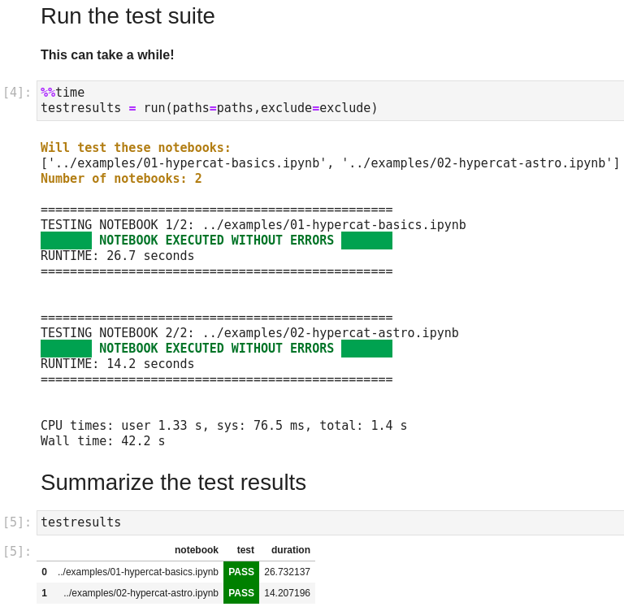
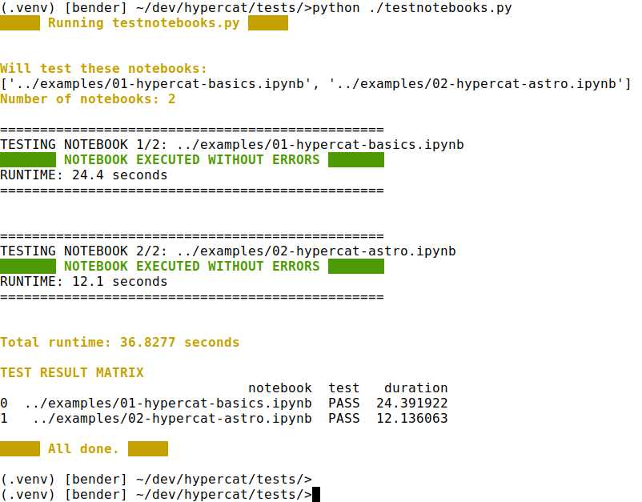

*Version:* 20210614 | *Author:* Robert Nikutta \<robert.nikutta@gmail.com\>

# Automatically test notebooks

  * [Synopsis](#synopsis)
  * [Preview](#preview)
  * [Steps: On your local Jupyter / JupyterLab or in the terminal](#steps-on-your-local-jupyter--jupyterlab-or-in-the-terminal)

## Synopsis
Run `testnotebooks.ipynb` to test a collection of other notebooks for runtime failures, e.g. the set of notebooks in the `examples/` directory.

## Preview

## Steps: On your local Jupyter / JupyterLab

1. In the Jupyter dashboard

  * Navigate to the new `foobar/tests/` sub-folder
  * Click on `testnotebooks.ipynb` to open the testing notebook

2. Run the cells in order from top to bottom.

  * If you want to test **all** notebooks, leave the `paths` variable as is. Note that a full test will take ~1 minute.
  Otherwise adjust `paths` as shown in the comment in that cell.

  * If you are OK with the defaults, leave the `exclude` variable as-is **(recommended)**.
  Otherwise, you can adjust it as shown in the comment in that cell, to exclude additional directories or notebooks from testing.

3. The notebooks will be tested one by one, with the test status printed in **green** if a notebooks runs error-free, and **red** if not. For failed notebooks, the tracelog will be printed out as well.

4. When all tests have finished, the final cell summarizes the test suite, with simple **PASS** / **FAIL** flags for each tested notebooks.

5. **FAIL**-ed (red) notebooks should of course by fixed, and a PR made on Github.

OR 

## Steps: in the terminal
 
1. `cd` into `notebooks-latest/tests/`
2. Either accept the default `paths` and `exclude` variables, or adjust them by editing them towards the end of the `testnotebooks.py` file. **Note: the `.py` file, not `.ipynb`!**

3. Run the test suite via: `python .testnotebooks.py`
  
   You will see something akin to this:
  
  
